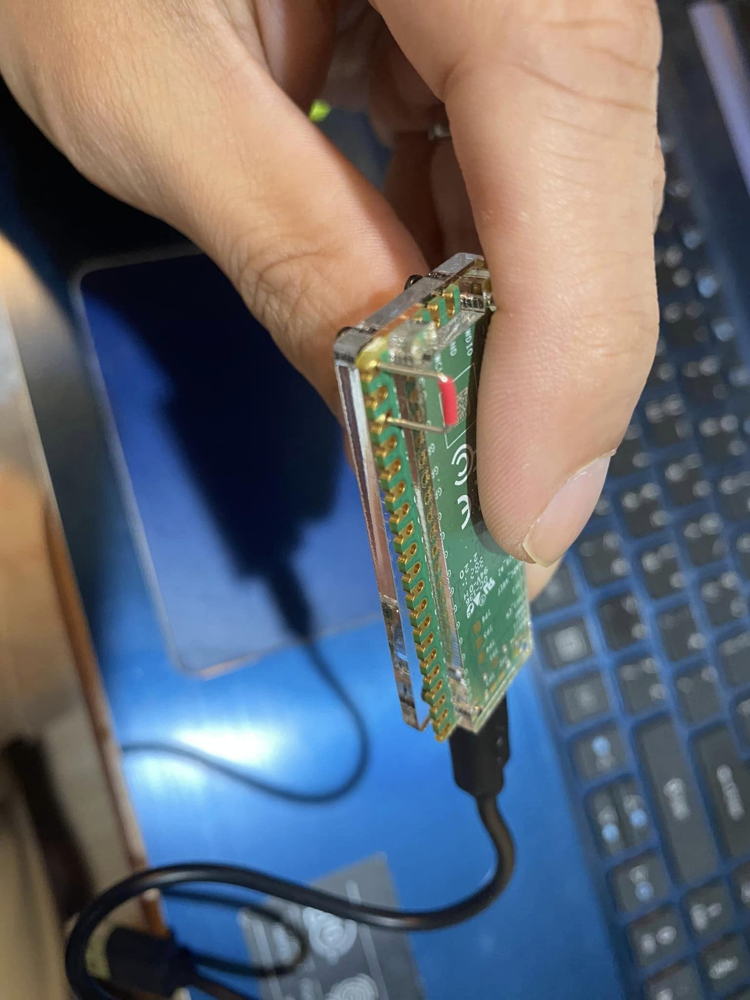
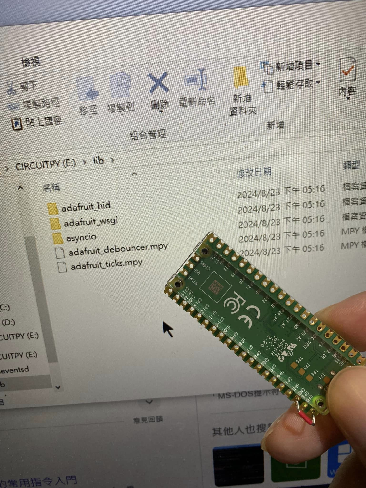

> :warning: **Disclaimer**: All content in this project is intended for security research purpose only.

## (學習用途) 模擬情境

如果老公每次都說加班，帶著筆電晚歸，工作好像都有做但總覺得怪怪的⋯  

用這小東西，趁老公開著電腦去尿尿時，插入usb約20秒，就會自動把電腦曾經登入過的「wifi名稱」和「密碼」寄到指定的信箱給你查看。
如果出現類似 女生的wifi名稱如「Amy的家」⋯⋯然後剛好密碼是一組手機號碼⋯就可以打過去問候對方認不認識自己的老公⋯⋯

## (學習用途) 理論

wifi雖然資安設計很好（應該吧？），但為了方便使用者能自動偵測連線，不用每次都重新輸入帳號密碼，一般電腦都會自動紀錄連線過的訊息（包含密碼）在電腦內。這算個人使用者的訊息，所以不用觸碰到管理員權限。  

如果要從外部得知密碼有不同層次的難度，但用另一種方式就能比較簡單取得資訊。  

要考慮到資安問題且不留痕跡，以下選擇：  

1. 用便宜的開發板（容量只有2MB）裝circuitPython環境運作（輕量級的環境可以用在小控制板上）  
2. 再裝模仿人類操作電腦、可以下指令的library（我裝了 按鍵仿生、時間延遲、連續觸擊矯正三個庫）
3.  避免操作被紀錄在windows日誌裡面，用windows內建的powershell下指令（目前大部份windows內建的5.1版確定不會被寫入日誌或紀錄）
4.  但是指令也是為了避免被紀錄行動？（程度不夠我不是很清楚），用windows內建的命令提示字元，去輸入powershell指令（這個關閉視窗應該就不會有紀錄⋯吧？）
5.  控制板腳位一個特別的位置接地，變低功耗，讓電腦usb連結時不會偵測到是usb裝置（所以也不會跳出任何畫面），默默自動執行指令。
6.  輸入指令的畫面可以設定成隱藏`-windowstyle Hidden（-w h ‘script code’）`，現在顯示出來只是覺得比較有視覺效果@@
7.  因為這板子沒有wifi模組，所以得利用連結的電腦當跳板寄送收集的資料，我是選擇用smtp伺服器寄送信件到我指定的地方，因為不太懂信箱port，想研究練習而已，直接用webhook連結應該會比較簡單也不會被發現資料傳送到哪去。

### powershell version

這個只是先拿來練習測試

### 大喵測試破解

以上程序3秒被大喵破解...

* 拿他電腦試用時, 發現腳本指令輸入不進去變亂碼... 因為是模仿人類操控，大喵電腦設定是每開一個視窗都自動切換到中文輸入法⋯我只考慮到capslock和指令在中文windows輸入編碼的問題，沒想到還有語言切換的問題⋯⋯（因為自己電腦都預設英文輸入，沒注意到各人使用習慣問題）
但要讀取系統語言並切換會觸碰admin權限，要再研究怎麼讓這program更通俗一點

> :warning: **Disclaimer**: All content in this project is intended for security research purpose only.